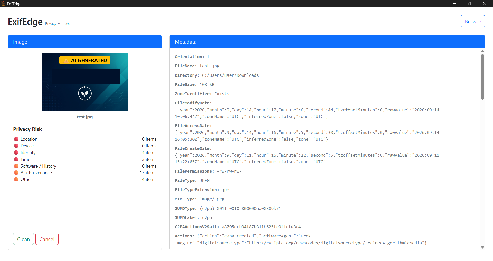

# ExifEdge

ExifEdge is a desktop privacy tool for removing privacy-sensitive metadata from images while preserving the actual image.

## Status
The development is in progress. The first version will be released very soon.

## Visual



## Supported Formats

- JPEG / JPG
- PNG

## Current Features

- Select JPEG and PNG images
- Analyze image metadata
- Display detected metadata
- Classify metadata by privacy risk
- Show privacy risk summary
- Identify location, device, identity, time, software/history, AI/provenance, and other privacy metadata
- Remove privacy-sensitive metadata
- Save a clean copy without modifying the original image
- Verify that removed metadata is no longer present

## Planned Features

- Complete JPEG metadata parser
- Complete PNG metadata parser
- EXIF metadata removal
- GPS/location data removal
- Camera and device information removal
- Personal identity metadata removal
- Timestamp removal
- Software and editing-history removal
- IPTC metadata removal
- XMP metadata removal
- JPEG comments removal
- PNG metadata chunk removal
- AI-generated image metadata removal
- C2PA / Content Credentials removal
- Embedded preview and thumbnail metadata removal
- Privacy-risk scoring
- Detailed sanitization report
- Before/after metadata comparison
- Sanitization verification
- Batch image processing
- Drag-and-drop image support
- Output folder selection
- Processing history
- Additional image formats in future versions

## Development

```bash
npm install
npm start
```

## Goal

ExifEdge aims to provide a simple desktop application for removing privacy-sensitive metadata from images 
without relying on a graphical wrapper around external metadata tools.

## Privacy

This project do not collect any user data or telemetry. See the [PRIVACY](PRIVACY) file for details.

## License

This project is licensed under the MIT License. See the [LICENSE](LICENSE) file for details.


